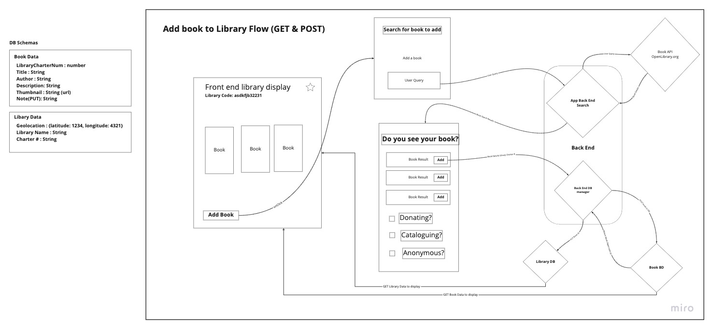

# **The Little Librarian**

## **The Little Librarian URL**

[Visit The Little Librarian](https://little-librarian.netlify.app/)

## **The vision**


- The vision of the product is to catalog and display the books available at **Little Free Library** locations around all communities where they are located.

## **The Problem Domain**


- **The Little Librarian** app increases awareness and access to these community resources by allowing users to see what books they can expect in a **Little Free Library** prior to travelling to the library's physical location.

## **The Importance**


- These valuable community-owned and operated resources are available nationwide and making it easier for them to be utilized will benefit all communities.
- Little Free Libraries can currently be found only by using `littlefreelibrary.org`; using our app will not only make these resources easier to locate but will provide a list of the titles each library has on hand.

**User Stories:**
[Trello Board](https://trello.com/b/0ab5BQlD/open-hand-data)

## **Software Requirements**

### **Project Scope (In/Out)**

#### **In Scope**

- allow you to search for a book in the entire library system
- show you what is in a specific library
- Allow you to delete a book in a library
- Allow you to add a note to the book
- Allow you to add a book to a library

#### **Out of Scope**

- Not going to show a map of locations
- Not going to add library locations

### **Minimum Viable Product**

- **What will your MVP functionality be?**
  - A user will be able add or remove a book from a library
  - A user will be able to search by a book or by library
  - A user will be able to leave a review on a book

### **Stretch Goals**

- **What are your stretch goals?**
  - Push in our seed data from `littlefreelibrary.org`  
  - Allow for the creation of a new library.
  - Allow for the User the ability to read book list/inventory of books.
- **What stretch goals are you going to aim for?**
  - Creation of a new library.

### **Functional Requirements**

- *A user will be able to...*
  - Add or remove a book from a library
  - Search by a book or by library
  - Leave a review for a book

### **Data Flow**




### **Non-Functional Requirements**

#### **Security**

- Our app will use Auth0 to make sure we have authorized users
- This will allow us to track and personalize to our users
- Our backend will validate requests to make sure it is coming from our front end
- Managing the uses of our api and databases so only our users are able to access those resources

#### **Database**

- Each item belongs to a single location
- The two databases will be a Library Database and a Book Database
  - There will be a identifier in the Library that will have an associated data point in the Book
- Each book is associated with only one library

### **DB Schemas**

```js
Library = {
  geolocation : {
    latitude: Number, 
    longitude: Number
    },
  libraryName : String,
  charter : String
}

Book = {
  libraryCharterNum : String,
  title : String,
  author : String,
  description: String,
  thumbnail : String, //url
  note: String //optional
}
```

## **Team Open-Hand Data**


### **Our Team Cooperation Plan**

### **Team key strengths?**

- **Steve** is familiar with the material and has already presented a 301 project. Strength in css
- **Joseph** has an aptitude for reading documentation and strong in react
- **Joey** is strong in design and layout. Strength in css
- **Sam** efficient and focused on task at hand

### **How are we going to utilize these street?**

- **Steve** and **Joey** will spearhead the design, layout and styling of the app.
- **Sam** and **Joseph** will be our power houses of new code design.

### **What professional competencies do you want work on?**

1. **Sam** wants to work as a team manager.
2. **Joey** wants to build his overall confidence and technical abilities.
3. **Joseph** endeavors to work on better collaboration skills.
4. **Steve** wants to strengthen his planning and time management as well as subject knowledge.

### **Our Daily Work Schedule**

- 9:00am to 6:00pm 12pm-2pm lunch designed but open to interpretation
- Morning standup to go over what is planned
- Afternoon will be bringing all the code together and planning for tomorrow

### **Conflict Plan**

#### **Conflict Resolution**

- One-on-one
- One and another group member
- Full group discussion
- Elevate as needed.

### **Communication Plan**

#### **Availability**

- **Joey** 10pm cutoff
- **Joseph** 10pm
- **Steve** communication always but delayed after hours
- **Sam** 10pm

#### **Communication Platforms**

- Slack
- Remo
- Zoom/Discord

#### **Breaks an off hours**

- As needed but will have planned lunch
- If we start to fall behind?
  - Reevaluate what is MVP for us
- Communication on off hours
  - Slack

### **Making Sure to Hear All Voices**

- Everyone will be sharing at stand up and stand down
- Frame responses with mutual respect.

### **Diversity Equity & Inclusion Plan**

- **Sam** is going to make sure he already assumes the best intentions in others.
- **Joey** wants to check his bias and assumptions.
- **Steve** wants to stay open to new ideas.
- **Joseph** wants to find route cause and understanding.

## **Work Plan**

### **Tools for collaboration and workflow**
  
- We will be creating a task list to manage features and daily tasks via our team Trello board.
- Mob programming and pair-programming will occur on LiveShare on VS code.

### **Git Process**
  
- Frontend and backend will live on the GitHub.
- Both repositories will be housed in our team organization.
- All Work will be completed on individual branches.
- Completed work will be pushed to staging and tested prior to merging.
- Otherwise work will be pushed as necessary.

### **PR Processes**
  
- Two reviewer approvals will be required to merge into main.
- One reviewer required for staging merges from individual branches.
- Merging will occur once a day or as necessary according to the team's approval.

### **Credit and Co-Conspirators**

- This amazing final project was thoughtfully created and masterfully crafted by the master-minds of **Samuel Panek**, **Joseph Streifel**, **Joey Hernandez**, and **Steve Ngo**!

### **Contact the Team**

[Follow Sam on LinkedIn](https://www.linkedin.com/in/samuel-panek/)

[Follow Joseph on LinkedIn](https://www.linkedin.com/in/josephjstreifel/)

[Follow Joey on LinkedIn](https://www.linkedin.com/in/jmhernandez2six/)

[Follow Steve on LinkedIn](https://www.linkedin.com/in/alsosteve/)
